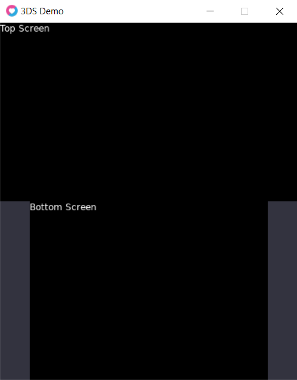

# dslayout
Simple utility library for the LÖVE framework to simulate Nintendo 2DS/3DS screens on the desktop.
Useful for development of games for the platform with [LÖVE Potion](https://github.com/lovebrew/lovepotion). Tested with LÖVE 11.4.



## What does it do?
First, it makes it easier to handle 2 screens. I used `love.graphics.translate` to offset the bottom screen drawing. You can draw each screen with its individual method.

It also handles the mouse input to behave like touch on the 3DS. Mouse only works on the bottom screen and only when it's pressed - so no pointer hover.

## Usage
Just put `dslayout.lua` wherever you need it, be it a library folder or your game folder. Next, `require` it and put handlers in place:
```lua
function love.load()
    dslayout:init(--[[optional configuration]])
end
function love.draw(screen)
    dslayout:draw(screen,
    function() 
        --[[top screen code goes here]]
    end, 
    function()
        --[[bottom screen code goes here]] 
    end)
end
function love.mousemoved(x,y,dx,dy,istouch)
  dslayout:mousemoved(x,y,dx,dy,istouch)
end

function love.mousepressed(x, y, button, istouch, presses)
  dslayout:mousepressed(x, y, button, istouch, presses)
end

function love.mousereleased(x, y, button, istouch, presses)
  dslayout:mousereleased(x, y, button, istouch, presses)
end
```
Check out the included demo `main.lua` to see it in practice. For the impatient, I compiled a [web version](https://nawias.github.io/dslayout/) (thanks to [LÖVE Web Builder](https://schellingb.github.io/LoveWebBuilder/)).

## Configuration

The ``dslayout:init()`` function takes in 2 optional parameters: 
* `color` - controls the color of the sidebars of the bottom screen, works with `{r,g,b,a}` format. The default value is `0.2, 0.2, 0.2, 1` 
* `title` - if a string value is present, it changes the window title. 

```lua
function love.load()
  dslayout:init({
    color = { r = 0.2, g = 0.2, b = 0.25, a = 1 },
    title = "3DS Demo"
  })
end
```
